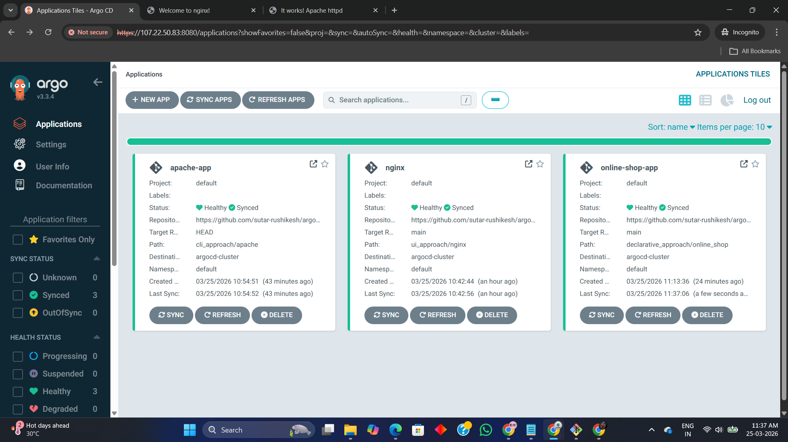
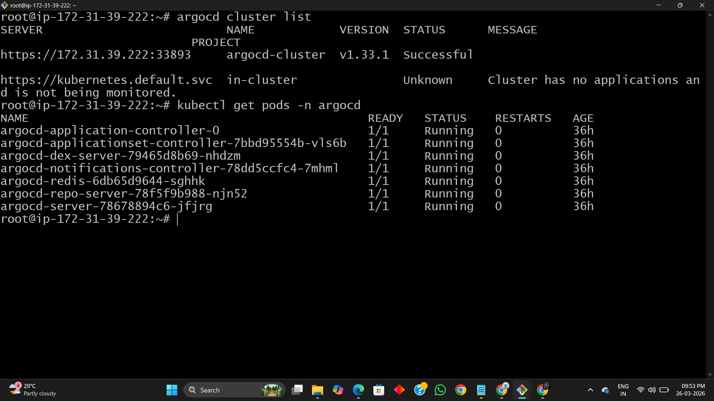
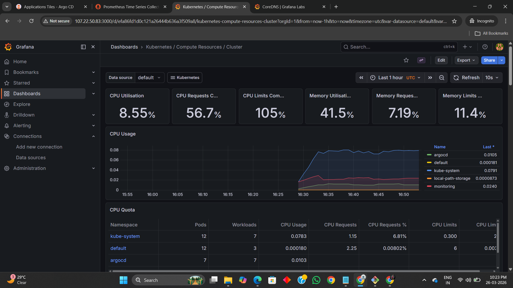

# 🚀 ArgoCD GitOps Deployment with Monitoring (Prometheus + Grafana)

## 📌 Project Overview

This project demonstrates a **complete GitOps-based Kubernetes deployment pipeline** using **ArgoCD**, along with a **production-grade monitoring stack** using **Prometheus and Grafana**.

It showcases:

* Declarative application deployment using GitOps
* Multi-approach deployment (UI, CLI, Declarative)
* Real-time monitoring and observability
* External access configuration via AWS Security Groups

---

## 🏗️ Architecture

```
                +----------------------+
                |      GitHub Repo     |
                |  (K8s Manifests)     |
                +----------+-----------+
                           |
                           v
                  +------------------+
                  |     ArgoCD       |
                  | (GitOps Engine)  |
                  +--------+---------+
                           |
          +----------------+----------------+
          |                                 |
          v                                 v
   +-------------+                   +--------------+
   |   NGINX     |                   |   Apache     |
   | Application |                   | Application  |
   +-------------+                   +--------------+

                           |
                           v
                +----------------------+
                |   Kubernetes Cluster |
                |      (Kind)          |
                +----------+-----------+
                           |
        +------------------+------------------+
        |                                     |
        v                                     v
+-------------------+               +-------------------+
|    Prometheus     |               |      Grafana      |
| Metrics Collector |               | Visualization UI  |
+-------------------+               +-------------------+
```

---

## ⚙️ Tech Stack

* Kubernetes (Kind Cluster)
* ArgoCD (GitOps Deployment)
* Helm (Package Manager)
* Prometheus (Monitoring)
* Grafana (Visualization)
* AWS EC2 (Infrastructure)
* kubectl / CLI tools

---

## 🚀 Deployment Steps

### 1️⃣ Create Kubernetes Cluster (Kind)

```bash
kind create cluster --name argocd-cluster
kubectl get nodes
```

---

### 2️⃣ Install ArgoCD

```bash
kubectl create namespace argocd

helm repo add argo https://argoproj.github.io/argo-helm
helm install argocd argo/argo-cd -n argocd
```

Verify:

```bash
kubectl get pods -n argocd
```

---

### 3️⃣ Access ArgoCD UI

```bash
kubectl port-forward svc/argocd-server -n argocd 8080:443
```

---

### 4️⃣ Deploy Applications

#### 🔹 UI-Based Deployment (NGINX)

* Navigate to ArgoCD UI
* Create new application
* Path: `ui_approach/nginx`

---

#### 🔹 CLI-Based Deployment (Apache)

```bash
argocd app create apache-app \
  --repo https://github.com/sutar-rushikesh/argocd-application-deployment.git \
  --path cli_approach/apache \
  --dest-server https://172.31.x.x:33893 \
  --dest-namespace default \
  --sync-policy automated \
  --self-heal \
  --auto-prune
```

---

#### 🔹 Declarative Deployment (Online Shop)

* Path: `declarative_approach/online_shop`
* Managed via GitOps manifests

---

### 5️⃣ Verify Applications

* All apps should show:

  * ✅ Healthy
  * ✅ Synced

---

## 📊 Monitoring Setup

### Install Prometheus + Grafana

```bash
helm repo add prometheus-community https://prometheus-community.github.io/helm-charts

helm install kube-prometheus-stack prometheus-community/kube-prometheus-stack \
  --namespace monitoring \
  --create-namespace
```

---

### Access Grafana

```bash
kubectl port-forward svc/kube-prometheus-stack-grafana -n monitoring 3000:80 --address 0.0.0.0
```

---

### Access Prometheus

```bash
kubectl port-forward svc/kube-prometheus-stack-prometheus -n monitoring 9090:9090 --address 0.0.0.0
```

---

### Get Grafana Password

```bash
kubectl get secret --namespace monitoring kube-prometheus-stack-grafana \
  -o jsonpath="{.data.admin-password}" | base64 --decode
```

---

## 🌐 External Access (AWS Security Groups)

Ports opened:

| Service    | Port |
| ---------- | ---- |
| ArgoCD UI  | 8080 |
| NGINX      | 8081 |
| Apache     | 8082 |
| Grafana    | 3000 |
| Prometheus | 9090 |

---

## 📸 Screenshots

### ArgoCD Applications



### Kubernetes Cluster & Pods



### Prometheus Targets


### Grafana Dashboard



---

## 🔥 Key Features

* GitOps-based continuous deployment
* Multi-deployment strategies (UI, CLI, Declarative)
* Auto-sync, self-healing, and pruning
* Real-time cluster monitoring
* Production-style architecture
* AWS exposure for external access

---

## ⚠️ Challenges & Learnings

* Fixed ArgoCD cluster registration issue (`InvalidSpecError`)
* Configured correct cluster endpoint
* Managed port forwarding for monitoring tools
* Integrated monitoring stack with Kubernetes

---

## 📈 Future Enhancements

* Add CI/CD pipeline (GitHub Actions)
* Integrate alerts (Slack / Email)
* Use Ingress Controller + Domain
* Add RBAC & security policies

---

## 👨‍💻 Author

**Rushikesh Sutar**
DevOps Engineer | Kubernetes | GitOps | Cloud

---

## ⭐ If you like this project

Give it a ⭐ on GitHub and share with others!
